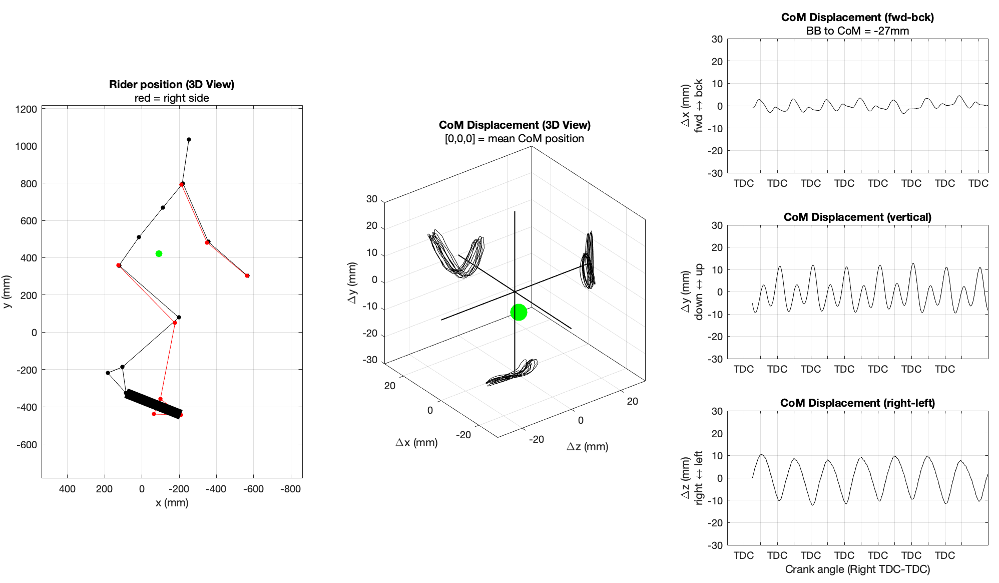

# vantage-com
Repo for the vantage com project



## Description

```matlab
% VANTAGE_COM Calculates a cyclist's center of mass position using
% reflective marker locations from a Retul Vantage motion capture system.
% 
% This script uses an output file (.pose) from the Retul Vantage Motion
% Capture system (left or right side) and generates a prediction and
% animation of the rider's Center of Mass (CoM) position and displacement.
% This animation is saved as a video file (.mp4). The mean position of the
% rider's CoM relative to the bottom bracket over the entire capture period
% is also calculated.
% 
%   Examples:
%   *Note: inputs need to be left blank or in exact order. I.e. next input
%   in sequence cannot be accessed if previous input is not present.
%   Default values can be entered if necessary.
%   Order sequence: file, anim, sex, mass, sacralAngle, sh_width, hp_width
%       - com3d = vantage_com 
%       - [com3d, com2bb, com2bbMean] = vantage_com 
%       - vantage_com('foo.pose')
%       - vantage_com('foo.pose','off')
%       - vantage_com('foo.pose','off','female')
%       - vantage_com('foo.pose','off','female', 60)
%       - vantage_com('foo.pose','off','female', 60, 63)
%       - vantage_com('foo.pose','off','female', 60, 63, 343)
%       - vantage_com('foo.pose','off','female', 60, 63, 343, 288)
% 
%   Inputs:
%        file - string containing the pose file name that you wish to load
%        (leave blank to choose from dialog box). File needs to exist in
%        current working directory.
% 
%        anim - string containing whether to produce an animation of the
%        rider 'on' or 'off' (default - 'on')
%        
%        sex - string containing the sex of rider 'male' or 'female'
%        (default - 'male')
%        
%        mass - mass of rider in kilograms (default - 78.05 kg for
%        male, 64.26 kg for female)
% 
%        sacralAngle - angle of lower back counter-clockwise from
%        horizontal (default - 54 degrees.)
% 
%        sh_width - width of rider's shoulders in millimeters (default -
%        411 for male, 367 for female)
% 
%        hp_width - width of rider's hips in millimeters (default - 296 for
%        male, 291 for female)  
% 
%        shoeMass - mass of each shoe in kilograms (default - 1 kg)
% 
%     Outputs: 
%         com3d - mx3 array of frame-by-frame three-dimensional CoM
%         position within the vantage-coordinate system, m = number of
%         frames. Data is upsampled to 200 Hz.
% 
%         com2bb - mx1 vector of fore-aft CoM position relative to the
%         estimated bottom bracket position. Data is upsampled to 200 Hz.
% 
%         com2bbMean - mean value of com2bb across all frames
% 
% Copyright (C) Ross Wilkinson 2020- vantage_com.m by Ross Duncan Wilkinson
% is licensed under a Creative Commons
% Attribution-NonCommercial-NoDerivatives 4.0 International License.
% ======================================================================= %
% Background: Determining the human body's center of mass is an important
% tool for analysing the biomechanics and energetics of human motion. In a
% biomechanical research setting, the most accurate estimates of each
% segment's CoM position requires placing and tracking the
% three-dimensional position of more than 38 markers (Tisserand et al.,
% 2016). This method is expensive and time consuming, which is impractical
% for certain applications like bike fitting. Therefore another approach is
% to use a reduced number of markers to estimate whole body CoM position
% (Dumas & Wojtusch, 2017). In either case, the technique involves
% determining the end points of each segment and estimates of body segment
% inertial parameters (BSIPs). BSIPs include BSIPs can be obtained in
% different ways including direct measurements on cadavers or
% photogrammetry and medical imaging on living humans, but they are more
% generally estimated by regression equations (based on those
% measurements).
% 
% The following approach uses BSIPs based on the regression equations of De
% Leva (1996) adjusted from the data of Zatsiorsky et al. (1990) in
% combination with Retul Vantage data (8 markers) to estimate the
% whole-body CoM position of a 16-segment rigid body biomechanical model
% (head with neck, upper trunk, middle trunk, lower trunk, upper arm (x2),
% forearm (x2), hand (x2), thigh (x2), shank (x2), and foot (x2).
% 
% Beyond the limitations inherent to estimating BSIPs, the main assumptions
% for this approach are:
% 
% # Retul Vantage marker placements correspond to segment end-points
% # Motion of the right and left limbs are symmetrical
% # The length of each subject's "head with neck" segment is the same
% within each sex
% # The "head with neck" segment is roughly aligned with the upper trunk
% (~45 degrees)
% # The length of each hand is 0
% # The length of each foot is from the calcaneus to the MTP joint
% 
% *References*
% 
% # de Leva, P. (1996). Adjustments to Zatsiorsky-Seluyanov?s segment
% inertia parameters. _Journal of Biomechanics_, _29_(9), 1223?1230.
% <https://doi.org/10.1016/0021-9290(95)00178-6
% https://doi.org/10.1016/0021-9290(95)00178-6>
% # Tisserand, R., Robert, T., Dumas, R., & Chèze, L. (2016). A simplified
% marker set to define the center of mass for stability analysis in dynamic
% situations. _Gait and Posture_, _48_, 64?67.
% <https://doi.org/10.1016/j.gaitpost.2016.04.032
% https://doi.org/10.1016/j.gaitpost.2016.04.032>
% # Dumas, R., & Wojtusch, J. (2017). Estimation of the Body Segment
% Inertial Parameters for the Rigid Body Biomechanical Models Used in
% Motion Analysis. In _Handbook of Human Motion_.
% <https://doi.org/10.1007/978-3-319-30808-1
% https://doi.org/10.1007/978-3-319-30808-1>
% ======================================================================= %
```
